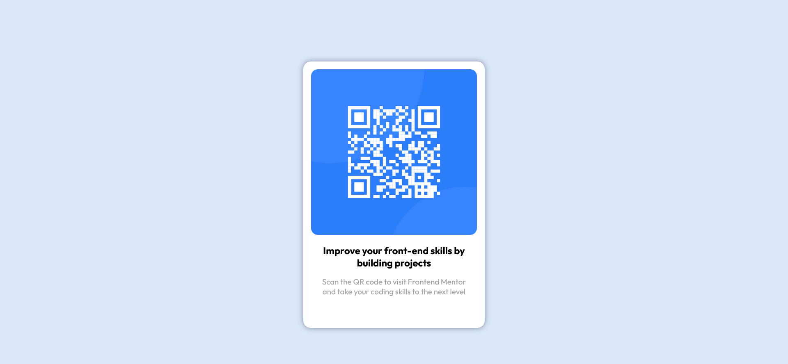

# Frontend Mentor - QR code component solution

### The challenge

Creating a responsive layout for a QR component.

This is a solution to the [QR code component challenge on Frontend Mentor](https://www.frontendmentor.io/challenges/qr-code-component-iux_sIO_H).

### Screenshots

## Desktop version

## Movil Version

### Built with

- Semantic HTML markup
- CSS flex-box
- CSS Responsive

### What I learned

I learned the adventages of using flex-box in the responsiveness manner.

### Links

- Solution URL: [My github repositories](https://github.com/yorchAdalbert/QR-code-component)
- Live Site URL:[qr-component.yorchadalbert](http://qr-component.yorchadalbert.com/)
- Live Site URL:[github page](https://yorchadalbert.github.io/QR-code-component/)

## Author
- Website - [Jorge Rodriguez](http://www.yorchadalbert.com)
- Frontend Mentor - [@yorchAdalbert](https://www.frontendmentor.io/profile/yorchAdalbert)